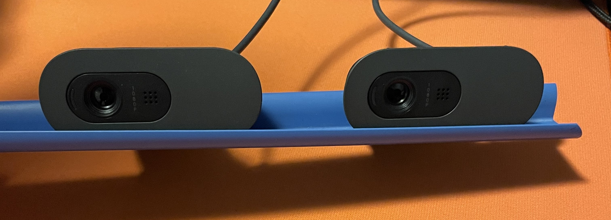
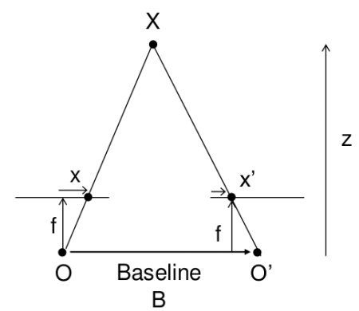
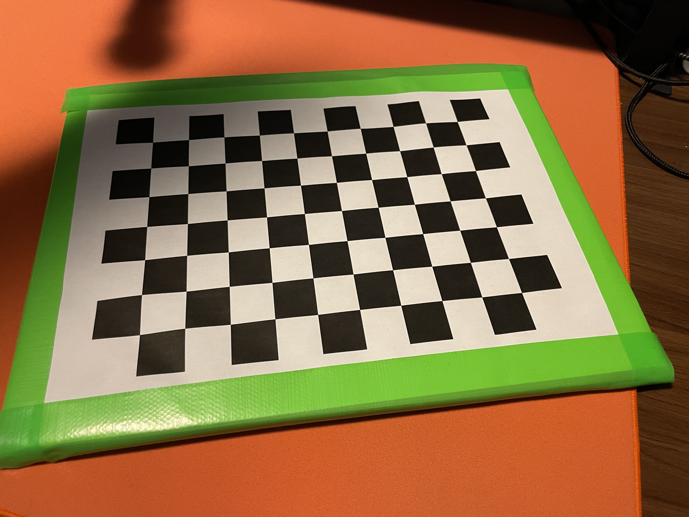
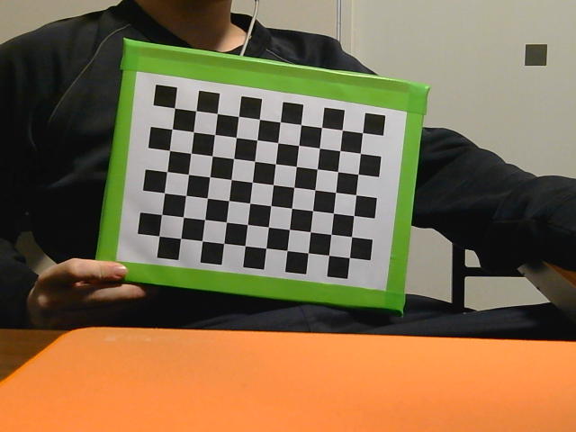
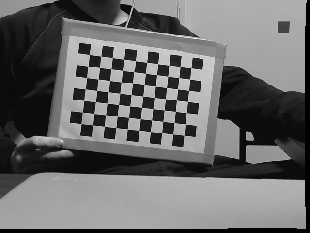
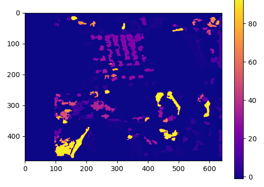

# ステレオカメラによる奥行き推定

## 概要
- 2台のカメラによって撮影される画像について，同じ物体の異なる視点からの画像を比較することで，三角測量の原理を用いて物体までの距離を推定することができる．

> <cite>[openCV] https://docs.opencv.org/4.x/dd/d53/tutorial_py_depthmap.html </cite>

## Stereo Camera Depth Estimationプロセス
・ステレオカメラによる奥行き推定は一般的に以下のプロセスで行われる
1. カメラキャリブレーション
2. 歪み補正ステレオ平行化
3. 視差測定
4. 奥行き推定

### 1.Camera Calibration
- カメラの個体差（レンズやイメージセンサの特性）によらない画像処理・奥行き推定を行うために，カメラの内部パラメタ（焦点距離，センサ中心情報）を取得するプロセス
- チェスボードのような高コントラスト・規則的な幾何学模様（特徴点が検出しやすい）パターンを用いる

### 2.Stereo Rectify
- カメラの内部パラメタを元に補正を行いカメラの個体差を排除する
- 水平に見えるような回転行列と移動行列を求める

### 3.Compute Disparity
- それぞれの画像の対応する点を求め，ピクセル座標のずれから視差を計算する
#### SGM参考
<cite>[Semi Global Matching (SGM) と 動的計画法] https://daily-tech.hatenablog.com/entry/2018/10/20/125423 </cite>

※ cv.stereoSGBMを用いて得られる視差は16倍で帰ってくるので距離変換時に補正する必要がある

### 4.reproject To 3D
視差を距離に変換する
（今後やります）